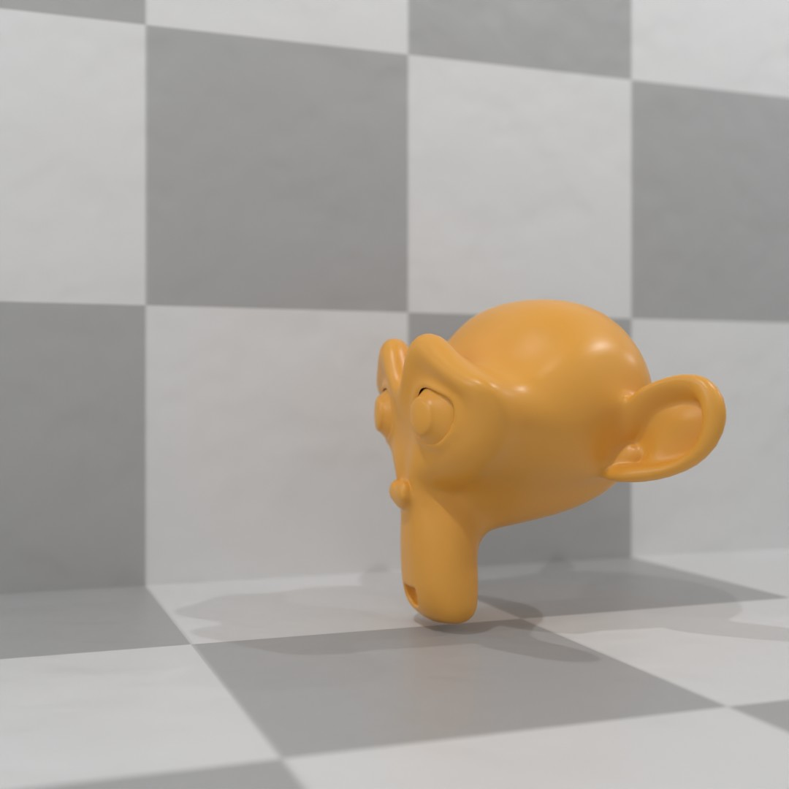

# Suzanneを主人公にショートアニメを作ってみた
ブレンダーでショートアニメーションを作ってみる

## ストーリーボード

|CUT|PICTURE|ACTION|TIME|
|---|---|---|---|
|1|😀←😀←|歩く、鏡がある、手前にピントがあう|0〜3|
|2|😲❗️😲❗️|鏡にびっくりする、鏡の向こうにピントが合う|3〜5|
|3|😌　😌　|鏡であると認識する、鏡越し|5〜8|
|4|😌←😏　|鏡じゃなかった|8〜12|

## 動画

YouTubeにあげています。 
[「Suzanneを主人公にショートアニメを作ってみた」 ](https://www.youtube.com/watch?v=3Vif4gxSR7w)

